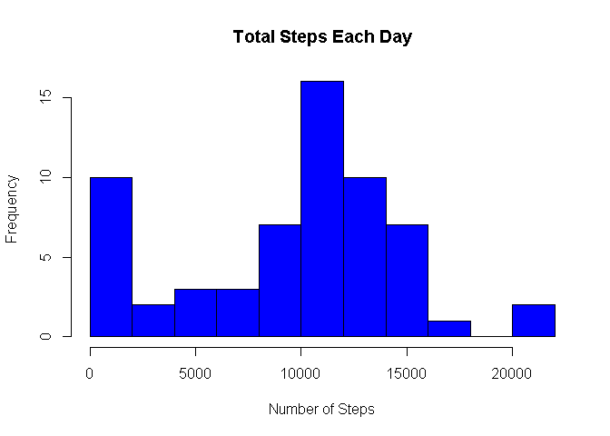
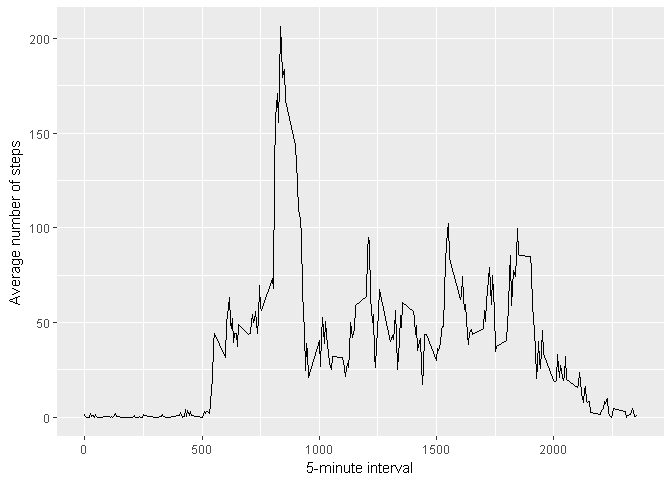
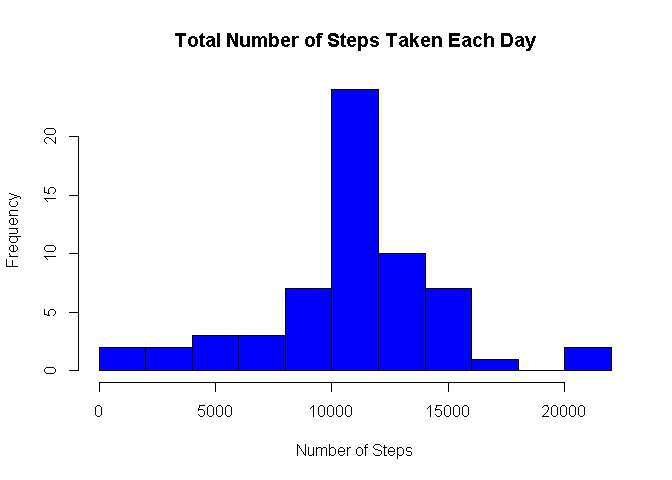

# Project1:ReproducibleResearch_ArleteRodrigues
ArleteRodrigues  
12 de Fevereiro de 2017  


```r
#######----------------------------------------------------------------####
#-------- Project course 1 --- Reproducible Research from Coursera -------#
#######----------------------------------------------------------------####

#Loading the input data
unzip(zipfile="repdata_data_activity.zip")
data <- read.csv("activity.csv")


#######----------------------------------------------------------------####
#-------------------------------------------------------------------------#
#######----------------------------------------------------------------####
##Question 1: What is mean total number of steps taken per day?

#1.Calculate the total number of steps taken per day
total.steps <- tapply(data$steps, data$date, FUN=sum, na.rm=TRUE)

#2.Make a histogram of the total number of steps taken each day
hist(total.steps, breaks=15, main = "Total Steps Each Day", col="blue", 
     xlab="Number of Steps")

#3.Calculate and report the mean and median of the total number of steps taken 
#per day
mean(total.steps, na.rm=TRUE)
```

```
## [1] 9354.23
```

```r
median(total.steps, na.rm=TRUE)
```

```
## [1] 10395
```

```r
#######----------------------------------------------------------------####
#-------------------------------------------------------------------------#
#######----------------------------------------------------------------####
##Question 2: What is the average daily activity pattern?

#1.Make a time series plot of the 5-minute interval (x-axis) and the average 
#number of steps taken, averaged across all days (y-axis)
library(ggplot2)
```

```
## Warning: package 'ggplot2' was built under R version 3.3.2
```

<!-- -->

```r
averages <- aggregate(x=list(steps=data$steps), by=list(interval=data$interval),
                      FUN=mean, na.rm=TRUE)
ggplot(data=averages, aes(x=interval, y=steps)) +  geom_line() +  
  xlab("5-minute interval") +  ylab("Average number of steps")
```

<!-- -->

```r
#2.Which 5-minute interval, on average across all the days in the dataset, 
#contains the maximum number of steps?
averages[which.max(averages$steps),]
```

```
##     interval    steps
## 104      835 206.1698
```

```r
#######----------------------------------------------------------------####
#-------------------------------------------------------------------------#
#######----------------------------------------------------------------####
##Question 3: Imputing missing values

#1.Calculate and report the total number of missing values in the dataset 
#(i.e. the total number of rows with NAs)
missing <- is.na(data$steps)
table(missing)
```

```
## missing
## FALSE  TRUE 
## 15264  2304
```

```r
#2.Devise a strategy for filling in all of the missing values in the dataset. 
#The strategy does not need to be sophisticated. For example, you could use the 
#mean/median for that day, or the mean for that 5-minute interval, etc.
fill.value <- function(steps, interval) {
  filled <- NA
  if (!is.na(steps))
    filled <- c(steps)
  else
    filled <- (averages[averages$interval==interval, "steps"])
  return(filled)
}
filled.data <- data

#3.Create a new dataset that is equal to the original dataset but with the 
#missing data filled in.
filled.data$steps <- mapply(fill.value, filled.data$steps, filled.data$interval)

#4.Make a histogram of the total number of steps taken each day and Calculate 
#and report the mean and median total number of steps taken per day. Do these 
#values differ from the estimates from the first part of the assignment? 
#What is the impact of imputing missing data on the estimates of the total daily 
#number of steps?
total.steps2 <- tapply(filled.data$steps, filled.data$date, FUN=sum)
hist(total.steps2, breaks=15, main = "Total Number of Steps Taken Each Day", 
     col="blue", xlab="Number of Steps")
```

<!-- -->

```r
mean(total.steps2)
```

```
## [1] 10766.19
```

```r
median(total.steps2)
```

```
## [1] 10766.19
```

```r
total.steps2 <- aggregate(steps ~ date, filled.data, sum)
total.steps1 <- aggregate(steps ~ date, data, sum)
sum(total.steps2$steps) - sum(total.steps1$steps)
```

```
## [1] 86129.51
```

```r
#######----------------------------------------------------------------####
#-------------------------------------------------------------------------#
#######----------------------------------------------------------------####
##Question 4: Are there differences in activity patterns between weekdays and 
#weekends?

#1.Create a new factor variable in the dataset with two levels - "weekday" 
#and "weekend" indicating whether a given date is a weekday or weekend day.
weekday.or.weekend <- weekdays(as.Date(filled.data$date))
wkd <- ifelse (weekday.or.weekend == "sábado" | 
                    weekday.or.weekend == "domingo", "weekend", "weekday")
filled.data$wkday <- as.factor(wkd)

#2.Make a panel plot containing a time series plot of the 5-minute interval (x-axis) and 
#the average number of steps taken, averaged across all weekday days or weekend 
#days (y-axis)
library(lattice)
dataplot <- aggregate(steps ~ wkday+interval, data=filled.data, FUN=mean)
xyplot(steps ~ interval | factor(wkday),layout = c(1, 2), xlab="Interval", 
       ylab="Number of steps", type="l", lty=1, data=dataplot)
```

<!-- -->


